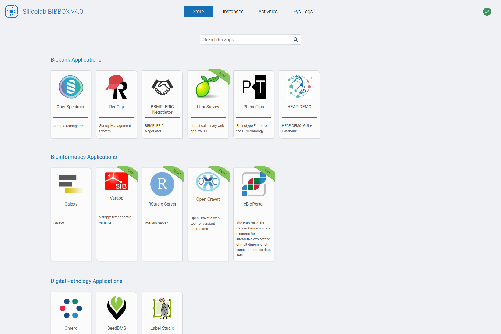

[](https://github.com/bibbox/sys-bibbox/actions)
[](https://github.com/bibbox/sys-bibbox/actions)


# BIBBOX 


The BIBBOX Framework serves as a Basic Infrastructure Building Box (BIBBOX),  which provides software solutions in form of apps for biobanking and bioinformatics. 
It provides the possibility to install apps and serve them directly towards the End-User. 
In the current state we are building apps to support pathologists, bioinformaticians and biobanks in their direct work as well as in Data-Management. 

<p align="center">
  
</p>

## Documentation

Please refer to the online documentation at [bibbox.readthedocs.io](https://bibbox.readthedocs.io/), which includes installation instructions, a user guide and a developer guide for the BIBBOX system.


## How It Works
 - Apps provided in the BIBBOX-**Store** can be easily installed with a few clicks and without any IT-knowledge.
 - Installed instances can be managed in the **Instances** tab.
   - See the apps dashboard by clicking the gear symbol on the bottom left of the apps tile.
   - Logs of an app are accessed by clicking the book symbol in the bottom-middle of the apps tile.
 - In the **Activities** tab each event can be expanded and contains a short descriptions about the nature of the given error.
 - The log of the individual system container of the BIBBOX can be inspected in the **Sys Logs** tab.

## Quicktstart (for development)

Please follow the install instructions on our read the docs page - [Install Bibbox(Linux)](https://bibbox.readthedocs.io/en/latest/installation_v4_bibbox_linux/) - for further details. 


<details><summary><b>Show short instructions</b></summary>

 1. Install docker and docker-compose

 2. Create the `bibbox` location folder

```sh
cd /opt
sudo mkdir bibbox
cd bibbox
```

 3. Clone the repository 

```sh
sudo git clone https://github.com/bibbox/sys-bibbox.git
cd sys-bibbox
```

 4. Run the installation script

```sh
sudo docker network create bibbox-default-network
sudo bash INSTALL.sh
```

 5. Domain-Settings
   - When asked to specify domainname:
     - You have a public domain under which you BIBBOX is running
     - Add the URL you want to use locally to your /etc/hosts file (or use localhost)
     - Set up a DNS Service (e.g.:dnsmasque) to create a local domain
</details>


## Debug Tools

### Celery Monitor 
`http://127.0.0.1:5011`

### Adminer   
`http://127.0.0.1:5012`

<details><summary><b>Show default access for the Postgres database</b></summary>
 
- **server:** postgres
- **username:** postgres
- **password:** postgres
- **database:** bibbox
</details>

### cadvisor
`http://127.0.0.1:5013`


## Structure

 The BIBBOX is structured in multiple docker containers:
##### apacheproxy
Proxy to enable access to the individual  installed app and serves the angular frontend.
##### backend
The backend  is  built  with Flask. Flask  is  a  Python  web  application  framework  based  on  the  Web  Server Gateway  Interface  (WSGI)  toolkit.
##### celery
Celery is a task manager which distributes tasks to worker instances. Celery usually uses a message broker such as Redis for the distribution of tasks.
##### celery-monitor
Monitor to inspect celery task.
##### postgres
Postgres is used as database and stores  activity  ,and  system  log  information,  which  can  be accessed  via  the  frontend.
##### redis
Redis is an in-memory data structure store, used as a (NoSQL) database, cache, and message broker.
##### adminer
Adminer can be used to access and manage databases.
##### cadvisor
cadvisor (Container Advisor) provides resource usage and performance characteristics of the running containers. 
